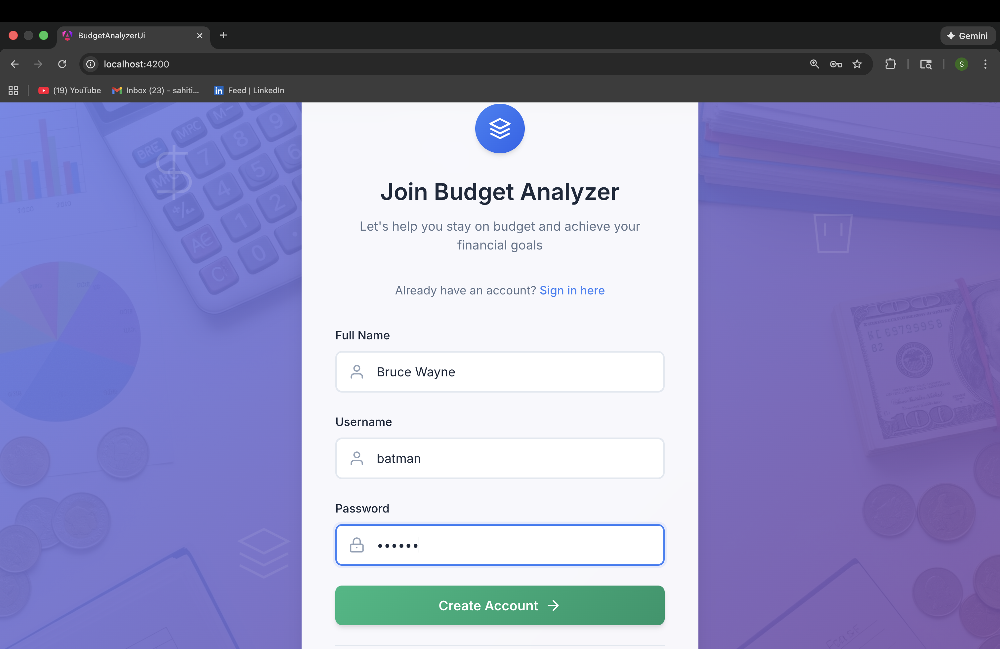
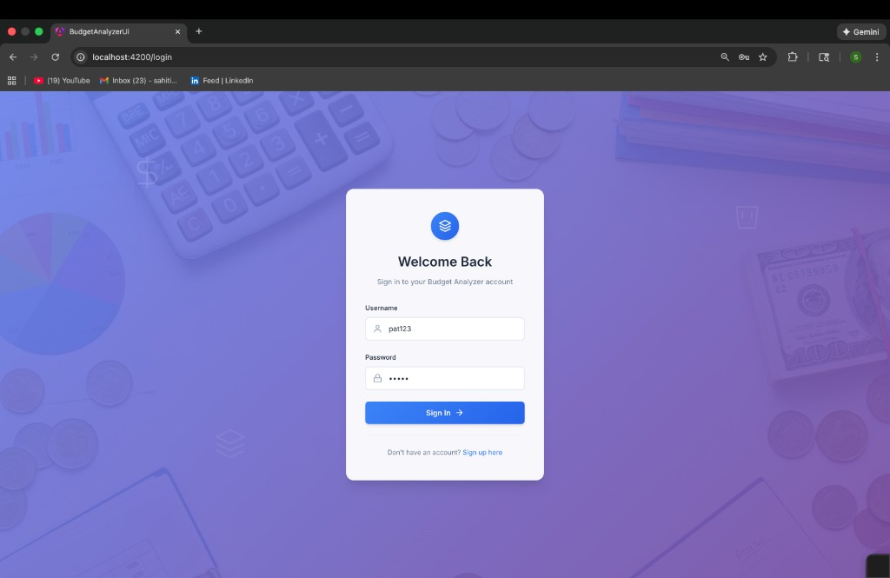
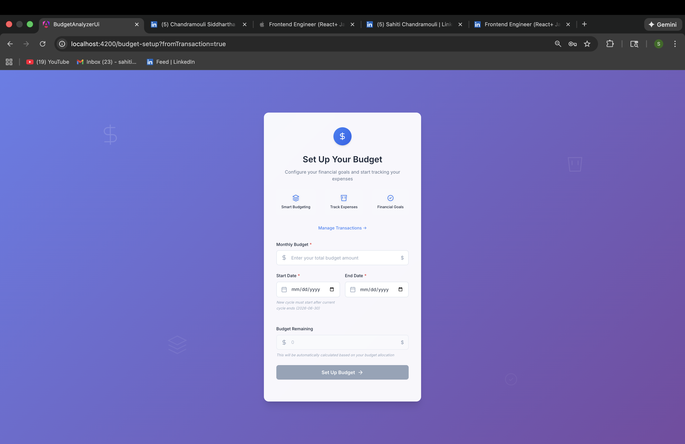
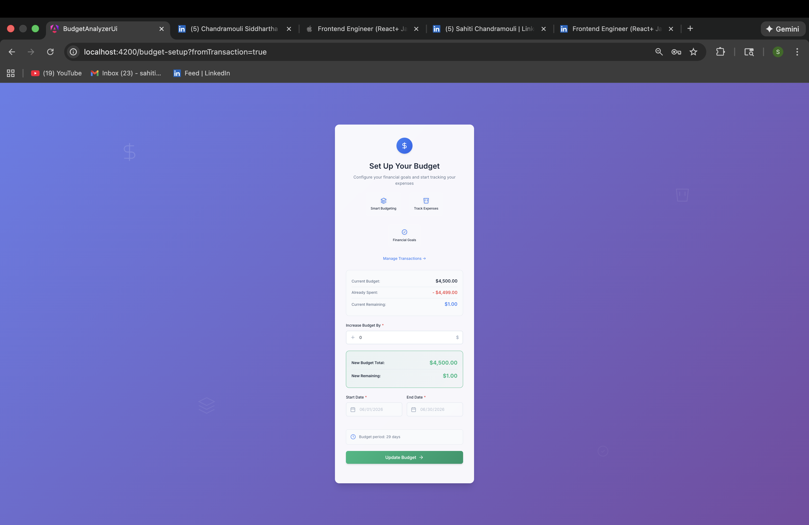
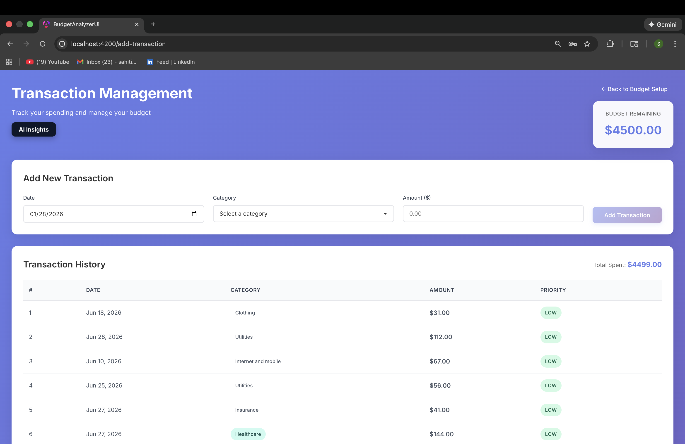
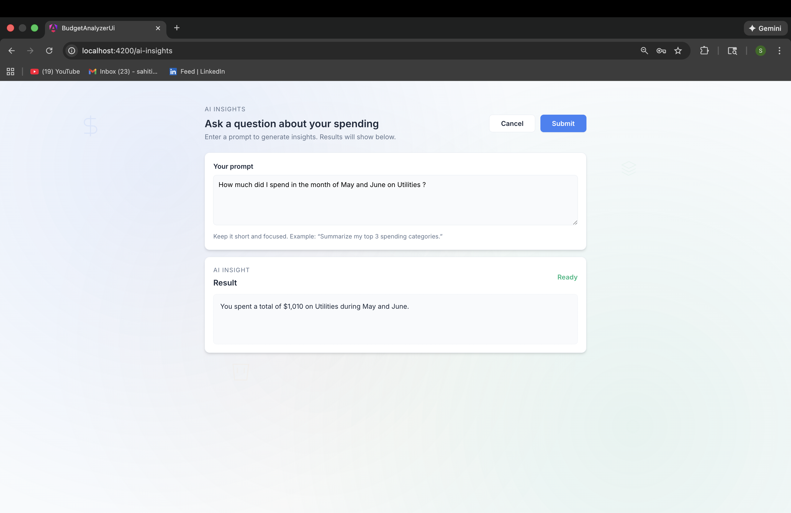

# Budget Analyzer UI

## About the application

This repo contains the **Angular frontend** for the **Budget Analyzer** app. It provides a simple end-to-end budgeting workflow:

- **Register** a new user
- **Login**
- **Set up salary/budget cycle**
- **Modify an existing budget cycle** (e.g., add additional budget within the current cycle)
- **Track expenses/transactions**
- **Request AI insights** about spending

The UI connects to a **Spring Boot + GraphQL backend** hosted in the backend repo: `https://github.com/schandr5/budget-analyzer`

## Prerequisites

- **Node.js**: 18+ (or 20+ recommended)
- **npm**: comes with Node.js
- **Angular CLI** (optional):
  - Use project-local CLI via `npx ng ...`, or
  - Install globally: `npm i -g @angular/cli`

## Setup & run (local, no Docker)

Clone and install dependencies:

```bash
git clone <this-repo-url>
cd budget_analyzer_ui
npm install
```

Start the dev server:

```bash
npm start
# or: ng serve
```

Open the app:

- `http://localhost:4200/`

## Backend API

This UI expects the backend to be running locally:

- **Backend base URL**: `http://localhost:8080`
- **GraphQL endpoint**: `http://localhost:8080/graphql`

### Where the GraphQL URL is configured

The GraphQL endpoint is configured in `src/app/app.config.ts` in the Apollo provider:

- **Variable name**: `uri`
- **Default value**: `http://localhost:8080/graphql`

To change it for local dev (or point to another environment), update the `uri` value here:

- `src/app/app.config.ts`

## Example usage flow (high-level)

Register → Login → Set up salary/budget cycle → Modify existing budget cycle (optional) → Add transactions → View transactions → Request AI insights.

## Scripts

Common npm scripts:

- **Start dev server**: `npm start`
- **Start with a clean Angular cache** (helpful if dev-server cache gets stuck): `npm run start:clean`
- **Build**: `npm run build`

## Project structure

Key folders:

- **App shell/routes**: `src/app/app.component.*`, `src/app/app.routes.ts`
- **Components/pages**: `src/app/components/`
- **GraphQL operations**: `src/app/graphql/`
- **Services (Apollo/data access)**: `src/app/services/`
- **Types/constants**: `src/app/constants/`

## Screenshots

UI screenshots - `docs/screenshots/`:

**Registration**


**Login**


**Budget setup**


**Budget modification**


**Transactions**


**AI insights**


## Troubleshooting

- **Backend not running / wrong GraphQL URL**
  - Confirm backend is up at `http://localhost:8080/graphql`.
  - If needed, update `uri` in `src/app/app.config.ts`.
- **CORS errors**
  - Ensure the backend allows requests from `http://localhost:4200`.
- **Vite “optimize deps” / missing chunk in `.angular/cache`**
  - Run `npm run start:clean` to clear the Angular cache and restart.
